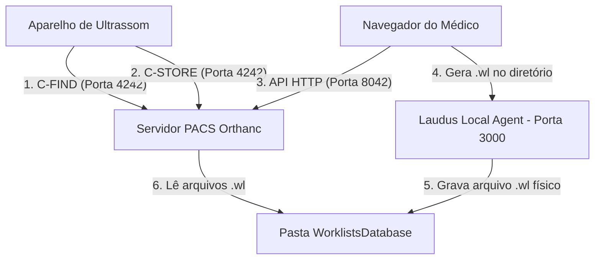

# Manual de Integração e Implantação PACS / DICOM (Orthanc) — LAUD.US
**Versão:** 2.1 · **Status:** Completo e Aprimorado · **Autor:** Time Laud.us

Este manual fornece todas as diretrizes técnicas necessárias para configurar, depurar e manter a sincronização de exames, imagens e worklist no sistema **LAUD.US** utilizando o servidor PACS open-source **Orthanc**.

Abaixo são apresentados em detalhes os dois métodos de implantação de rede suportados:
*   **Método 1: Rede Local (Intranet) + Orthanc**
*   **Método 2: Tailscale VPN (Mesh P2P) + Orthanc** (Recomendado para uso na Nuvem/Vercel)

---

## 1. Diagramas de Arquitetura e Fluxo de Dados

### 1.1 Método 1: Rede Local (Intranet Física)
Este método é adequado quando tanto o navegador do médico quanto o aparelho de ultrassom estão conectados fisicamente à mesma rede do servidor PACS.



### 1.2 Método 2: Tailscale VPN (Híbrido Nuvem-Local)
Este método é obrigatório quando o sistema é acessado de fora da clínica (ou via Vercel HTTPS) para contornar restrições de Mixed Content no navegador e dispensar redirecionamento de portas (Port Forwarding).

```mermaid
graph TD
    subgraph Nuvem (Vercel)
        LaudusApp[Navegador HTTPS]
    end

    subgraph Rede Privada VPN (Tailscale)
        LaudusApp -- API Proxy HTTPS --> TailscaleDNS[servidor-pacs.ts.net:8443]
    end

    subgraph Servidor Físico (Clínica)
        TailscaleDNS --> LocalAgent[Laudus Local Agent - HTTPS]
        LocalAgent -- API REST local --> LocalOrthanc[Orthanc Local - Porta 8042]
        LocalAgent -- Grava arquivo .wl --> WLDir[Pasta WorklistsDatabase]
        LocalOrthanc -- Lê arquivos .wl --> WLDir
    end

    subgraph Intranet Física (Clínica)
        US[Aparelho de Ultrassom] -- C-FIND / C-STORE (Porta 4242) --> LocalOrthanc
    end
```

---

## 2. Preparação do Servidor (Instalação e Dependências)

### 2.1 Instalando o Python e a Biblioteca `pydicom`
A geração de arquivos de worklist física (`.wl`) é gerenciada no servidor por um script Python compilador (`scripts/generate_wl.py`).
1.  **Instalação do Python 3:**
    *   **Windows:** Baixe o instalador do Python 3 no site oficial. **Importante:** Na primeira tela, marque a caixa **"Add python.exe to PATH"** antes de clicar em instalar.
    *   **macOS:** Instale via Homebrew: `brew install python`.
2.  **Instalação da dependência `pydicom`:**
    Abra o terminal ou prompt de comando no servidor e execute:
    ```bash
    pip install pydicom
    ```
    *Se houver erro de permissão no Windows, execute o prompt como Administrador. No macOS, use `pip3 install pydicom`.*

### 2.2 Instalando o Orthanc
*   **No Windows:**
    Baixe a versão empacotada de instalador oficial (Lunatec ou Orthanc Installer). Selecione a opção **"Install Orthanc as a Windows Service"** para garantir que o servidor inicie automaticamente com o computador.
*   **No macOS:**
    Instale usando o Homebrew:
    ```bash
    brew install orthanc
    brew services start orthanc
    ```

---

## 3. Configuração do Orthanc (`orthanc.json`)

Localize o arquivo de configuração (no Windows fica em `C:\Program Files\Orthanc Server\Configuration\orthanc.json`). Abra-o como administrador em um editor de texto e certifique-se de configurar os seguintes parâmetros vitais:

```json
{
  "Name" : "PACS LAUDUS Principal",
  "StorageDirectory" : "C:\\OrthancServer\\db\\OrthancStorage",
  "IndexDirectory" : "C:\\OrthancServer\\db\\OrthancStorage",
  "StorageCompression" : true,
  "DicomServerEnabled" : true,
  "DicomPort" : 4242,
  "DicomAet" : "ORTHANC",
  "HttpPort" : 8042,
  "HttpServerEnabled" : true,
  
  // Habilita a autenticação básica na API HTTP (vital para segurança)
  "AuthenticationEnabled" : true,
  "RegisteredUsers" : {
    "admin" : "sua_senha_secura_aqui"
  },

  // Cadastro de aparelhos autorizados a enviar imagens (C-STORE) e requisitar worklist (C-FIND)
  "DicomModalities" : {
    "US_SALA_01" : [ "MINDRAYMX7", "192.168.1.150", 104 ],
    "US_SALA_02" : [ "GE_LOGIQ", "192.168.1.151", 4100 ]
  },

  // Ativação do plugin de Worklist embutido
  "Worklists" : {
    "Enable" : true,
    "Database" : "C:\\OrthancServer\\db\\WorklistsDatabase\\"
  },

  "Plugins" : [
    "C:\\Program Files\\Orthanc Server\\Plugins"
  ],

  "ConcurrentJobs" : 4,
  "DicomAlwaysAllowEcho" : true,
  "DicomAlwaysAllowStore" : true
}
```
*Salve o arquivo e reinicie o serviço do Orthanc (no Windows: abra `services.msc`, localize 'Orthanc' e clique em 'Reiniciar').*

---

## 4. O Agente Local (Laudus Local Agent)

O script `scripts/agent.js` deve rodar ininterruptamente na máquina PACS local para atuar como ponte entre a nuvem e a pasta física do Orthanc.

### 4.1 Inicialização Manual
Abra o prompt de comando ou terminal no diretório do projeto e execute:
```bash
node scripts/agent.js
```
O console exibirá que o agente está ativo na porta `3000`.

### 4.2 Rodando como Serviço no Windows (via NSSM)
Para evitar que o agente feche caso o usuário faça logout da máquina:
1.  Baixe o **NSSM** (Non-Sucking Service Manager) em [nssm.cc](https://nssm.cc).
2.  Extraia o arquivo executável e abra o prompt de comando como Administrador no mesmo diretório.
3.  Execute:
    ```cmd
    nssm install LaudusLocalAgent
    ```
4.  Na janela visual que se abre:
    *   **Path:** Selecione o caminho do executável do Node (geralmente `C:\Program Files\nodejs\node.exe`).
    *   **Startup directory:** Selecione a pasta raiz do projeto `LAUDUS`.
    *   **Arguments:** `scripts/agent.js`
5.  Clique em **"Install service"**.
6.  Abra o gerenciador de serviços do Windows (`services.msc`) e inicie o serviço `LaudusLocalAgent`. Ele agora iniciará sozinho em segundo plano.

### 4.3 Rodando como Serviço no macOS (via launchd)
Crie um arquivo em `/Library/LaunchDaemons/com.laudus.agent.plist`:
```xml
<?xml version="1.0" encoding="UTF-8"?>
<!DOCTYPE plist PUBLIC "-//Apple//DTD PLIST 1.0//EN" "http://www.apple.com/DTDs/PropertyList-1.0.dtd">
<plist version="1.0">
<dict>
    <key>Label</key>
    <string>com.laudus.agent</string>
    <key>ProgramArguments</key>
    <array>
        <string>/usr/local/bin/node</string>
        <string>/Users/usuario/Documents/LAUDUS/scripts/agent.js</string>
    </array>
    <key>RunAtLoad</key>
    <true/>
    <key>KeepAlive</key>
    <true/>
</dict>
</plist>
```
Carregue o daemon no sistema:
```bash
sudo launchctl load -w /Library/LaunchDaemons/com.laudus.agent.plist
```

---

## 5. Método 2 em Detalhes: Configurando HTTPS / SSL no Tailscale

Ao rodar a aplicação em servidores HTTPS (como Vercel), requisições HTTP locais (`http://100.x.y.z:8042`) serão sumariamente bloqueadas pelo navegador. O Tailscale oferece uma infraestrutura de SSL nativa de forma automatizada.

### 5.1 Configurando o Certificado Let's Encrypt do Tailscale
1.  Abra o painel do Tailscale e navegue em **Settings > DNS**.
2.  Habilite o **MagicDNS** caso não esteja ativo.
3.  Role até **HTTPS Certificates** e clique em **Enable HTTPS**.
4.  No servidor local, gere o certificado executando o comando no terminal:
    ```bash
    tailscale cert nome-do-seu-servidor.tail861dda.ts.net
    ```
    Isso gerará os arquivos `nome-do-seu-servidor.tail861dda.ts.net.crt` e `nome-do-seu-servidor.tail861dda.ts.net.key` na pasta de execução.

### 5.2 Configurando SSL Nativo diretamente no Orthanc
Se desejar criptografar o próprio Orthanc diretamente para que a Vercel consulte a porta 8443 de forma nativa e sem intermédio de agentes, adicione as seguintes linhas no seu arquivo `orthanc.json`:
```json
{
  ...
  "HttpPort" : 8443,
  "SslEnabled" : true,
  "SslCertificate" : "C:\\OrthancServer\\config\\certificado_combinado.pem"
}
```
*Dica: Para gerar o arquivo `.pem` combinado exigido pelo Orthanc, abra o prompt de comando do Windows e concatene a chave privada e o certificado em um único arquivo:*
```cmd
copy /b nome-do-seu-servidor.tail861dda.ts.net.crt + nome-do-seu-servidor.tail861dda.ts.net.key certificado_combinado.pem
```

---

## 6. Configurando o Aparelho de Ultrassom

Acesse o menu de configurações do equipamento de imagem (ex: Mindray, GE, Samsung) e realize as parametrizações a seguir:

### 6.1 Configurando o Worklist (Lista de Trabalho)
1.  Navegue até **DICOM Settings > Worklist > Add**.
2.  Preencha as informações:
    *   **Name / Alias:** `Laudus Worklist`
    *   **IP Address:** Digite o IP da máquina servidora (use o IP local `192.168.1.100` se o ultrassom estiver na mesma Wi-Fi local que a máquina do PACS).
    *   **Port:** `4242`
    *   **AE Title:** `ORTHANC`
    *   **Modality AE Title (Local):** `MINDRAYMX7` (deve ser o mesmo nome cadastrado no `DicomModalities` no `orthanc.json`).
3.  Clique no botão **Verify / Test**. O sistema deve acusar "Sucesso".

### 6.2 Configurando o Envio de Imagens (Store)
1.  Navegue até **DICOM Settings > Storage > Add**.
2.  Preencha as informações idênticas:
    *   **Name / Alias:** `Laudus Storage`
    *   **IP Address:** IP do servidor local (`192.168.1.100`).
    *   **Port:** `4242`
    *   **AE Title:** `ORTHANC`
3.  Clique no botão **Verify / Test**.

---

## 7. Diagnóstico e Resolução de Problemas (Troubleshooting)

### 7.1 Erro: `C-FIND SCP failed` ou `No worklists found` no Ultrassom
*   **Verificação 1:** Abra a pasta configurada em `Worklists.Database` no Orthanc (ex: `C:\OrthancServer\db\WorklistsDatabase`) e verifique se existem arquivos com a extensão `.wl`.
*   **Verificação 2:** Certifique-se de que o AE Title local configurado no ultrassom coincide com a entrada cadastrada no `DicomModalities` do arquivo `orthanc.json`.
*   **Verificação 3:** O firewall do Windows no computador servidor pode estar bloqueando a porta **4242**. Desative-o temporariamente para testar ou adicione uma regra de entrada.

### 7.2 Erro de Mixed Content no console do Navegador
*   **Sintoma:** Ao tentar abrir a aba PACS ou carregar thumbnails de imagens no editor, nada carrega e o painel de inspeção do navegador (`F12`) acusa erro de carregamento de conteúdo misto (`Mixed Content`).
*   **Causa:** O LAUD.US em HTTPS está tentando ler uma URL HTTP não segura (`http://100.93.111.95:8042`).
*   **Solução:** Habilite o HTTPS no Tailscale e aponte os links do seu painel do Laud.us para usar o endereço público seguro (`https://...ts.net:8443`).

### 7.3 Erro de Permissão na criação da Worklist
*   **Sintoma:** O Laudus Local Agent acusa que a pasta de destino não pode ser acessada.
*   **Solução:** Garanta que o usuário que está rodando o `node scripts/agent.js` ou o serviço de plano de fundo do Windows tenha permissões totais de leitura e escrita na pasta de destino das Worklists configurada.
