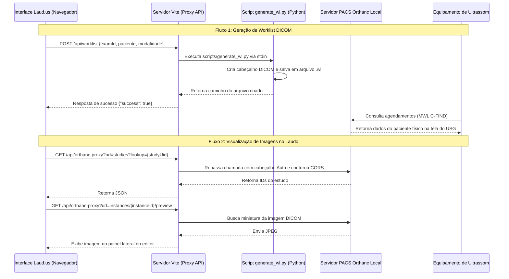

# 🩺 LAUD.US — Sistema de Laudos Ultrassonográficos Premium

O **LAUD.US** é um ecossistema digital premium de alta performance projetado para médicos radiologistas e ultrassonografistas. Ele oferece um fluxo de trabalho completo que vai do agendamento à geração automatizada de laudos complexos e integrados, com o auxílio de inteligência artificial de ponta (Google Gemini e Anthropic Claude).

O sistema foi desenhado para operar na nuvem com persistência multi-tenant (Firebase) e integrar-se nativamente com equipamentos de ultrassom e servidores PACS locais via protocolo DICOM (Worklist e Visualização de Imagens).

---

## 🚀 Principais Funcionalidades

### 1. Worklist Inteligente e Fluxo de Trabalho (Worklist)
- Gerenciamento dinâmico de exames em três estados: `Pendente` (agendado/espera), `Em Andamento` (na sala de exame/redação) e `Finalizado` (assinado/concluído).
- Integração bidirecional com a modalidade física de ultrassom via geração de arquivos DICOM Modality Worklist.

### 2. Editor Clínico de Texto Rico (TipTap Editor)
- Baseado no motor de edição híbrida TipTap, otimizado para laudos médicos estruturados.
- Suporta a formatação avançada de análises clínicas, tabelas de medição e placeholders de normalidade.
- Copiador inteligente que transfere o laudo em HTML rico diretamente para a área de transferência, mantendo a compatibilidade visual perfeita com o Google Docs e editores externos.

### 3. LAUD.IA 2.0 (Motor de IA Clínica)
- Geração inteligente baseada nos achados coletados em formulários dinâmicos.
- Suporte a múltiplos provedores: **Google Gemini (SDK Oficial)** e **Anthropic Claude (REST API com SSE Streaming)**.
- **Prompt Caching**: Arquitetura otimizada que separa o contexto estático do sistema (regras rígidas, protocolos de especialidade e normalidade) das variáveis dinâmicas do paciente, reduzindo o custo de tokens em até 40%.
- **Mimetismo de Estilo**: Capacidade de injetar até 10 laudos finalizados anteriores do mesmo médico como contexto de referência de escrita para a IA manter a identidade linguística do profissional.
- **Filtro de Segurança (`stripScratchpad`)**: Limpeza automática de pensamentos internos (scratchpads) ou blocos de código gerados pelos modelos antes da exibição ao médico.

### 4. Integração DICOM / PACS (Orthanc local)
- **Worklist Generator**: Criação de arquivos `.wl` compatíveis com o padrão DICOM de forma automatizada.
- **Orthanc Proxy**: Middleware que gerencia o fluxo de autenticação e contorna limitações de CORS para visualização de estudos e instâncias locais.
- **Visualizador Stone**: Visualização e seleção direta de fatias e capturas do exame na tela do editor.
- **Grade de Imagens para Impressão**: Layout customizado em PDF composto por grade fotográfica otimizada (grade padrão de 2 colunas e 3 linhas) para anexar ao laudo impresso.

### 5. Biblioteca de Calculadoras Clínicas
- Coleção integrada de 18 calculadoras com inserção automatizada de valores calculados no editor:
  - **TIRADS, BIRADS, O-RADS**: Classificações de risco padronizadas internacionalmente.
  - **Obstetrícia & Fetal**: CRL (Comprimento Cabeça-Nádega), Idade Gestacional (DDP), Biometria Fetal e Curva de Crescimento de Barcelona.
  - **Vascular & Doppler**: Razão de diâmetros, índices de resistência e relação de fluxo.
  - **Fórmulas Gerais**: Volume de órgãos, peso prostático, índice de veia cava, etc.

### 6. Gestão Multi-Clínica e RBAC
- Suporte a múltiplas unidades de atendimento com logotipos, cabeçalhos, rodapés e templates (máscaras) individuais.
- Controle de acesso baseado em papéis (RBAC):
  - **Admin**: Configuração global, logs de auditoria detalhados, faturamento e ativação de licenças.
  - **Médico**: Gerenciamento e assinatura de laudos.
  - **Recepção**: Cadastro de pacientes e agendamento na Worklist.

---

## 🛠️ Tecnologias Utilizadas

### Frontend & Core
- **React 18** (SPA rápida e altamente responsiva)
- **TypeScript** (Tipagem forte e rigorosa em todo o fluxo de dados)
- **Vite 6** (Empacotador rápido e servidor de desenvolvimento customizado)
- **Tailwind CSS** (Tema premium customizado com foco em contraste e interface clínica)
- **Zustand** (Gerenciamento de estado leve e modularizado)
- **Framer Motion** (Micro-animações e transições de tela premium)
- **Lucide React** (Pacote de ícones unificado)

### Backend & Serviços
- **Firebase Firestore** (Banco de dados NoSQL com sincronização em tempo real)
- **Firebase Authentication** (Autenticação segura via e-mail/senha)
- **Google Gemini API SDK** / **Anthropic API** (Modelos LLM generativos)

### Geração & Manipulação de Arquivos
- **docx.js** (Geração e empacotamento nativo de arquivos Microsoft Word)
- **pydicom** (Script Python executado localmente para criação de cabeçalhos de compatibilidade DICOM)

---

## 📦 Estrutura de Diretórios do Projeto

```bash
laudos-us/
├── scripts/
│   └── generate_wl.py       # Script Python usando pydicom para gerar arquivos de Worklist (.wl)
├── src/
│   ├── components/          # Componentes globais de UI (Botões, Modais, Toasts, etc.)
│   ├── hooks/               # Hooks React utilitários (Firestore, Auth)
│   ├── lib/                 # Inicialização e configs de SDKs (firebase.ts)
│   ├── modules/             # Módulos funcionais encapsulados da aplicação:
│   │   ├── admin/           # Telas do painel de administração (usuários, auditoria, planos)
│   │   ├── ai/              # Configuração do Gemini/Claude e repositório de prompts
│   │   ├── calculators/     # Biblioteca e UI das 18 calculadoras clínicas
│   │   ├── clinics/         # Gestão de unidades e configurações de impressão
│   │   ├── dashboard/       # Métricas de exames e painel inicial do médico
│   │   ├── editor/          # Editor de laudo, integração com PACS, formulários dinâmicos
│   │   ├── export/          # Layout de impressão de imagens e exportador de arquivos Word (.docx)
│   │   ├── laud-ia/         # Formulários inteligentes e refinamento por IA
│   │   ├── patients/        # Cadastro e prontuário eletrônico de pacientes
│   │   ├── settings/        # Configurações do médico (CRM, RQE, chaves de API, prompts)
│   │   ├── templates/       # Editor de máscaras clínicas reutilizáveis
│   │   └── worklist/        # Gerenciamento de exames e fluxo de agendamento
│   ├── store/
│   │   └── db.ts            # Camada centralizada de acesso a dados (CRUD + listeners do Firestore)
│   ├── styles/
│   │   └── index.css        # Estilos globais e tokens de cores Tailwind customizados
│   ├── types.ts             # Definição de tipos TypeScript centrais do negócio
│   ├── App.tsx              # Componente raiz que gerencia as rotas e navegação interna
│   └── main.tsx             # Ponto de entrada do React
├── tailwind.config.js       # Configuração e definição do design system premium
├── vite.config.ts           # Servidor de desenvolvimento com middleware de Proxy local
└── package.json             # Definições de dependências npm
```

---

## ⚙️ Instalação e Configuração Local

### Requisitos Prévios
- **Node.js** v18+ e npm v9+
- **Python 3.10+** (com a biblioteca `pydicom` instalada globalmente ou no seu ambiente virtual):
  ```bash
  pip install pydicom
  ```

### 1. Clonar e Instalar Dependências
```bash
git clone <url-do-repositorio>
cd laudos-us
npm install
```

### 2. Configurar Variáveis de Ambiente
Crie um arquivo chamado `.env.local` na raiz do projeto e configure as credenciais do seu Firebase:

```env
# Configurações do Firebase Client
VITE_FIREBASE_API_KEY=sua_api_key_aqui
VITE_FIREBASE_AUTH_DOMAIN=seu-app.firebaseapp.com
VITE_FIREBASE_PROJECT_ID=seu-app
VITE_FIREBASE_STORAGE_BUCKET=seu-app.appspot.com
VITE_FIREBASE_MESSAGING_SENDER_ID=seu_sender_id
VITE_FIREBASE_APP_ID=seu_app_id
```

---

## 🔌 Detalhes de Integração e Arquitetura PACS/Orthanc

Para que a Worklist e a visualização de imagens DICOM funcionem de forma integrada em ambiente de consultório ou hospital, o LAUD.US utiliza uma arquitetura híbrida descrita abaixo:

### 1. Servidor de Desenvolvimento Vite com Proxy reverso
Como o navegador do médico está rodando sob HTTPS ou em porta de host diferente (`http://localhost:5173`) do PACS local (`http://localhost:8042`), chamadas diretas seriam bloqueadas por CORS, e o navegador exigiria autenticação básica contínua. 

O arquivo [vite.config.ts](file:///Users/matheuskistenmackerpires/Desktop/laudos-us/vite.config.ts) define um plugin de middleware chamado `localOrthancWorklistPlugin` que intercepta requisições locais e faz o tratamento necessário:
- **`/api/orthanc-proxy`**: Encaminha as requisições para o Orthanc local, injeta as credenciais de autenticação básica (armazenadas nas configurações do médico no banco de dados) e remove os cabeçalhos `WWW-Authenticate` da resposta para que o navegador nunca exiba pop-ups invasivos de login.
- **`/api/worklist` (POST)**: Recebe os dados de agendamento criados na recepção e executa o script [generate_wl.py](file:///Users/matheuskistenmackerpires/Desktop/laudos-us/scripts/generate_wl.py) via subprocesso, escrevendo o arquivo de worklist diretamente na pasta do servidor local.
- **`/api/worklist` (DELETE)**: Remove o arquivo `.wl` do disco quando o exame é concluído ou excluído da Worklist do dia.



### 2. Configurações de Presets do Servidor PACS
Nas configurações do sistema, o médico pode selecionar o tipo de servidor PACS local:
- **Mac Mini (Padrão macOS)**: Aponta a pasta de destino para `/Users/matheuskistenmackerpires/Documents/OrthancServer/db/WorklistsDatabase/` e o servidor para `http://100.93.111.95:8042`.
- **Notebook (Padrão Windows)**: Aponta a pasta de destino para `C:\OrthancServer\db\WorklistsDatabase\` e o servidor para `http://localhost:8043`.
- **Customizado**: Permite configurar caminhos de rede e endereços IP arbitrários.

---

## 💻 Executando o Projeto

### Servidor de Desenvolvimento
Roda a aplicação localmente na porta `5173`:
```bash
npm run dev
```

### Compilar para Produção (Build)
Gera o pacote de produção otimizado na pasta `dist/`:
```bash
npm run build
```

### Validar Tipagens TypeScript
Executa a validação de tipos de forma estática:
```bash
npx tsc --noEmit
```
