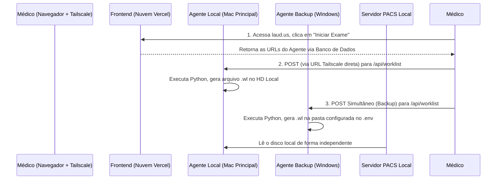

# 🩺 LAUD.US — Sistema de Laudos Ultrassonográficos Premium (v3.0.0)

O **LAUD.US** é um ecossistema digital premium de alta performance projetado para médicos radiologistas e ultrassonografistas. Ele oferece um fluxo de trabalho completo que vai do agendamento à geração automatizada de laudos complexos e integrados, com o auxílio de inteligência artificial de ponta (Google Gemini e Anthropic Claude).

O sistema foi desenhado para operar na nuvem com persistência multi-tenant (Firebase) e integrar-se nativamente com equipamentos de ultrassom e servidores PACS locais via protocolo DICOM (Worklist e Visualização de Imagens).

---

## 🚀 Principais Funcionalidades

### 1. Worklist Inteligente e Fluxo de Trabalho (Worklist)
- Gerenciamento dinâmico de exames em três estados: `Pendente` (agendado/espera), `Em Andamento` (na sala de exame/redação) e `Finalizado` (assinado/concluído).
- Integração bidirecional com a modalidade física de ultrassom via geração de arquivos DICOM Modality Worklist.

### 2. Editor Clínico de Texto Rico (TipTap Editor)
- Baseado no motor de edição híbrida TipTap, otimizado para laudos médicos estruturados.
- Suporta a formatação avançada de análises clínicas, tabelas de medição e placeholders de normalidade.
- Copiador inteligente que transfere o laudo em HTML rico diretamente para a área de transferência, mantendo a compatibilidade visual perfeita com o Google Docs e editores externos.

### 3. LAUD.IA 2.0 (Motor de IA Clínica)
- Geração inteligente baseada nos achados coletados em formulários dinâmicos.
- Suporte a múltiplos provedores: **Google Gemini (SDK Oficial)** e **Anthropic Claude (REST API com SSE Streaming)**.
- **Prompt Caching**: Arquitetura otimizada que separa o contexto estático do sistema (regras rígidas, protocolos de especialidade e normalidade) das variáveis dinâmicas do paciente, reduzindo o custo de tokens em até 40%.
- **Mimetismo de Estilo**: Capacidade de injetar até 10 laudos finalizados anteriores do mesmo médico como contexto de referência de escrita para a IA manter a identidade linguística do profissional.
- **Filtro de Segurança (`stripScratchpad`)**: Limpeza automática de pensamentos internos (scratchpads) ou blocos de código gerados pelos modelos antes da exibição ao médico.

### 4. Integração DICOM / PACS (Orthanc local)
- **Worklist Generator**: Criação de arquivos `.wl` compatíveis com o padrão DICOM de forma automatizada.
- **Orthanc Proxy**: Middleware que gerencia o fluxo de autenticação e contorna limitações de CORS para visualização de estudos e instâncias locais.
- **Visualizador Stone**: Visualização e seleção direta de fatias e capturas do exame na tela do editor.
- **Grade de Imagens para Impressão**: Layout customizado em PDF composto por grade fotográfica otimizada (grade padrão de 2 colunas e 3 linhas) para anexar ao laudo impresso.

### 5. Biblioteca de Calculadoras Clínicas
- Coleção integrada de 18 calculadoras com inserção automatizada de valores calculados no editor:
  - **TIRADS, BIRADS, O-RADS**: Classificações de risco padronizadas internacionalmente.
  - **Obstetrícia & Fetal**: CRL (Comprimento Cabeça-Nádega), Idade Gestacional (DDP), Biometria Fetal e Curva de Crescimento de Barcelona.
  - **Vascular & Doppler**: Razão de diâmetros, índices de resistência e relação de fluxo.
  - **Fórmulas Gerais**: Volume de órgãos, peso prostático, índice de veia cava, etc.

### 6. Gestão Multi-Clínica e RBAC
- Suporte a múltiplas unidades de atendimento com logotipos, cabeçalhos, rodapés e templates (máscaras) individuais.
- Controle de acesso baseado em papéis (RBAC):
  - **Admin**: Configuração global, logs de auditoria detalhados, faturamento e ativação de licenças.
  - **Médico**: Gerenciamento e assinatura de laudos.
  - **Recepção**: Cadastro de pacientes e agendamento na Worklist.

---

## 🛠️ Tecnologias Utilizadas

### Frontend & Core
- **React 18** (SPA rápida e altamente responsiva)
- **TypeScript** (Tipagem forte e rigorosa em todo o fluxo de dados)
- **Vite 6** (Empacotador rápido e servidor de desenvolvimento customizado)
- **Tailwind CSS** (Tema premium customizado com foco em contraste e interface clínica)
- **Zustand** (Gerenciamento de estado leve e modularizado)
- **Framer Motion** (Micro-animações e transições de tela premium)
- **Lucide React** (Pacote de ícones unificado)

### Backend & Serviços
- **Firebase Firestore** (Banco de dados NoSQL com sincronização em tempo real)
- **Firebase Authentication** (Autenticação segura via e-mail/senha)
- **Google Gemini API SDK** / **Anthropic API** (Modelos LLM generativos)

### Geração & Manipulação de Arquivos
- **docx.js** (Geração e empacotamento nativo de arquivos Microsoft Word)
- **pydicom** (Script Python executado localmente para criação de cabeçalhos de compatibilidade DICOM)

---

## 📦 Estrutura de Diretórios do Projeto

```bash
laudos-us/
├── scripts/
│   └── generate_wl.py       # Script Python usando pydicom para gerar arquivos de Worklist (.wl)
├── src/
│   ├── components/          # Componentes globais de UI (Botões, Modais, Toasts, etc.)
│   ├── hooks/               # Hooks React utilitários (Firestore, Auth)
│   ├── lib/                 # Inicialização e configs de SDKs (firebase.ts)
│   ├── modules/             # Módulos funcionais encapsulados da aplicação:
│   │   ├── admin/           # Telas do painel de administração (usuários, auditoria, planos)
│   │   ├── ai/              # Configuração do Gemini/Claude e repositório de prompts
│   │   ├── calculators/     # Biblioteca e UI das 18 calculadoras clínicas
│   │   ├── clinics/         # Gestão de unidades e configurações de impressão
│   │   ├── dashboard/       # Métricas de exames e painel inicial do médico
│   │   ├── editor/          # Editor de laudo, integração com PACS, formulários dinâmicos
│   │   ├── export/          # Layout de impressão de imagens e exportador de arquivos Word (.docx)
│   │   ├── laud-ia/         # Formulários inteligentes e refinamento por IA
│   │   ├── patients/        # Cadastro e prontuário eletrônico de pacientes
│   │   ├── settings/        # Configurações do médico (CRM, RQE, chaves de API, prompts)
│   │   ├── templates/       # Editor de máscaras clínicas reutilizáveis
│   │   └── worklist/        # Gerenciamento de exames e fluxo de agendamento
│   ├── store/
│   │   └── db.ts            # Camada centralizada de acesso a dados (CRUD + listeners do Firestore)
│   ├── styles/
│   │   └── index.css        # Estilos globais e tokens de cores Tailwind customizados
│   ├── types.ts             # Definição de tipos TypeScript centrais do negócio
│   ├── App.tsx              # Componente raiz que gerencia as rotas e navegação interna
│   └── main.tsx             # Ponto de entrada do React
├── tailwind.config.js       # Configuração e definição do design system premium
├── vite.config.ts           # Servidor de desenvolvimento com middleware de Proxy local
└── package.json             # Definições de dependências npm
```

---

## ⚙️ Instalação e Configuração Local

### Requisitos Prévios
- **Node.js** v18+ e npm v9+
- **Python 3.10+** (com a biblioteca `pydicom` instalada globalmente ou no seu ambiente virtual):
  ```bash
  pip install pydicom
  ```

### 1. Clonar e Instalar Dependências
```bash
git clone <url-do-repositorio>
cd laudos-us
npm install
```

### 2. Configurar Variáveis de Ambiente
Crie um arquivo chamado `.env.local` na raiz do projeto e configure as credenciais do seu Firebase:

```env
# Configurações do Firebase Client
VITE_FIREBASE_API_KEY=sua_api_key_aqui
VITE_FIREBASE_AUTH_DOMAIN=seu-app.firebaseapp.com
VITE_FIREBASE_PROJECT_ID=seu-app
VITE_FIREBASE_STORAGE_BUCKET=seu-app.appspot.com
VITE_FIREBASE_MESSAGING_SENDER_ID=seu_sender_id
VITE_FIREBASE_APP_ID=seu_app_id
```

---

## 🔌 Arquitetura Oficial de Integração PACS/Orthanc (Nuvem + Local)

Para que a Plataforma LAUD.US, hospedada na nuvem (Vercel), possa se comunicar com segurança com os equipamentos físicos e servidores DICOM (Orthanc) dentro das clínicas de forma transparente, o sistema adota uma arquitetura híbrida distribuída utilizando a VPN Tailscale.

### 1. A Arquitetura Híbrida (Vercel + Tailscale + Agentes Locais)

O LAUD.US opera dividindo as responsabilidades de rede:
- **Frontend Vercel (Nuvem):** Todo o painel, relatórios de IA e o banco de dados Firebase estão na nuvem, garantindo alta disponibilidade e acessibilidade global.
- **Agentes Locais (Vite Plugin via Node.js):** Pequenos servidores locais executando `npm run dev` rodam diretamente nos servidores da clínica (Servidor Principal Mac e Servidor de Backup Windows).
- **Tailscale (VPN Zero-Config):** Os Agentes Locais expõem endpoints seguros HTTPS via VPN Tailscale (`https://servidor-mac.tail861dda.ts.net:10443`, etc.).
- **Comunicação Direta (Bypass da Nuvem):** Para garantir que as integrações locais funcionem mesmo a Vercel não tendo acesso direto à rede interna da clínica, o frontend roda uma lógica de inteligência de roteamento (`isVercel`). Ele instrui o **navegador do médico** a se comunicar **diretamente** com o IP/URL do Agente Local através da rede Tailscale à qual o médico já está conectado. Isso evita gargalos, problemas de CORS, e elimina completamente a dependência de middlewares complexos ou liberação de portas em roteadores.

### 2. O Funcionamento do Agente Local
O arquivo `vite.config.ts` conta com o plugin `localOrthancWorklistPlugin` que transforma o ambiente de desenvolvimento Vite em um verdadeiro servidor middleware para receber os payloads (dados) do Vercel e executar rotinas de baixo-nível na máquina do Windows ou Mac:

- **`/api/worklist` (POST)**: Recebe os dados de agendamento via JSON. O Node.js executa o script Python `generate_wl.py` recebendo esses dados nativamente via entrada padrão (`stdin`), eliminando o uso de argumentos de terminal.
- **Geração Segura de Worklist:** O script Python (usando a biblioteca `pydicom`) cria arquivos `.wl` com cabeçalhos DICOM compatíveis com qualquer equipamento e deposita na pasta física configurada no `.env`.
- **Tratamento Seguro de Erros:** Qualquer falta de biblioteca (como pydicom) ou falha de Python é repassada como erro tratável para o frontend, e exibe as instruções de correção amigavelmente no navegador do usuário.

### 3. Configurações Dinâmicas Oficiais (`.env`)
O antigo modelo de caminhos físicos engessados no código foi completamente descontinuado. Toda a configuração das pastas de destino das Worklists e caminhos de execução dos agentes locais (Windows e Mac) são configurados estritamente pelo arquivo `.env` nativo de cada máquina:

```env
# Exemplo de Configuração de Agente Local (Mac Mini)
VITE_ORTHANC_WORKLIST_DIR=/Volumes/MATHEUS SSD/OrthancServer/db/WorklistsDatabase/
VITE_PYTHON_PATH=python3

# Exemplo de Configuração de Agente de Backup (Windows)
VITE_ORTHANC_WORKLIST_DIR=C:\OrthancServer\db\WorklistsDatabase\
VITE_PYTHON_PATH=python
```

> [!IMPORTANT]
> **Fluxo Dual de Segurança:** O sistema frontend é programado para tentar sincronizar automaticamente com o Servidor Principal. Caso configurado, o mesmo fará simultaneamente um espelhamento assíncrono enviando o payload diretamente ao Agente do Servidor de Backup de forma paralela.



---

## 💻 Executando o Projeto

### Servidor de Desenvolvimento
Roda a aplicação localmente na porta `5173`:
```bash
npm run dev
```

### Compilar para Produção (Build)
Gera o pacote de produção otimizado na pasta `dist/`:
```bash
npm run build
```

### Validar Tipagens TypeScript
Executa a validação de tipos de forma estática:
```bash
npx tsc --noEmit
```

---

## 🐳 Executando via Docker (Produção)

A aplicação conta com suporte completo para conteinerização via Docker utilizando build multi-stage e servidor Nginx configurado para Single Page Applications (SPA) e PWA.

### 1. Iniciar o Container
Para compilar e iniciar o container em segundo plano mapeando a porta `5173` do seu computador:
```bash
docker compose up -d --build
```

### 2. Acessar a Aplicação
Uma vez iniciado o container, acesse:
[http://localhost:5173](http://localhost:5173)

### 3. Parar o Container
Para encerrar a execução do container e remover os recursos criados:
```bash
docker compose down
```
